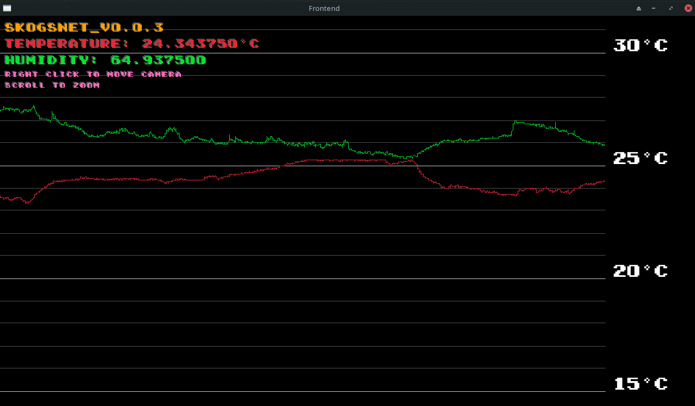

# Skogsnet   [![Badge License]][license]

_Temperature and Humidity monitoring._

# New version of Skogsnet
This project has been deprecated in favor of the new version, which is a complete rewrite in Go with a more modern architecture and better performance.

For the latest version, please visit:
[Skogsnet V2](https://github.com/Avicted/skogsnet_v2)


<br>

## Concept

Using a **[I2C Grove Sensor]**, you can transmit <br>
temperature / humidity data with a **[Arduino <br>
MKR1010 Wifi][arduino]**
board.

The Arduino sends the data through Serial USB <br>
to the host, where the program `skogsnet.cpp` <br>
reads the serial stream and parses the JSON data.

This data can then be used as inputs to some <br>
logic, a PID regulator implementation perhaps.

The data received by the skogsnet program is written out to **output.dat**

<br>


## Dependencies

_How to install required dependencies._

```shell
sudo pacman -S raylib nlohmann-json base-devel cmake 
```

_Add the current user to the group of the USB device port:_
```shell
# Show the group
ls -l /dev/ttyACM0
crw-rw---- 1 root uucp 166, 0 Oct 18 21:41 /dev/ttyACM0

# Add the current user to the group
sudo usermod -aG uucp $(whoami)

# Logout -> Login again
```

## Running

_How to start both programs._

```shell
make -j 2 skogsnet raylibfrontend
```

## Skogsnet output
```bash
> make -j 2 skogsnet raylibfrontend
g++  -O0 -g -Wall -std=c++11 -Wno-narrowing -I/usr/include  -c -o code/skogsnet.o code/skogsnet.cpp

Creating directories
mkdir -p build
mkdir -p ./raylib_frontend/build

Building the and running raylib frontend
g++ -O0 -g -Wall -std=c++11 -Wno-narrowing -I/usr/include -o ./raylib_frontend/build/raylibfrontend ./raylib_frontend/frontend.cpp -L /usr/lib -lstdc++ -lm  -lraylib -lm -lpthread
./raylib_frontend/build/raylibfrontend
	No input args OK!
	Current working directory: /home/avic/projects/Skogsnet
	Hello from raylib_frontend!
	Successfully read data points from file! Total points in buffer: 100000

Building the program
g++ -O0 -g -Wall -std=c++11 -Wno-narrowing -I/usr/include -o ./build/skogsnet ./code/PID.cpp ./code/skogsnet.cpp -L /usr/lib -lstdc++ -lm 
./build/skogsnet
	Setting up time measurement and serial communications...
./build/skogsnet

      Trying port: /dev/ttyACM0

        Skogsnet is running now, connected to port: /dev/ttyACM0


        Measurement:
        Timestamp:		1725985596922
        TemperatureCelcius:	23.656250
        Humidity:		80.812500

	Successfully wrote to file: output.dat

        Measurement:
        Timestamp:		1725985602463
        TemperatureCelcius:	23.625000
        Humidity:		80.875000

	Successfully wrote to file: output.dat


^C	Caught SIGINT, exiting peacefully!

        dummy: 2
        Exiting successfully.
	Memory used in GigaBytes: 0.001118
	Memory used in MegaBytes: 1.144409

Freeing DataPoints: 1200000

        [Performance Metrics]
        Total memory allocated 		 = 0.0 MB
        Current Wall clock run time 	 = 9.0 secs
```

## Raylib Frontend



<!----------------------------------------------------------------------------->

[badge license]: https://img.shields.io/badge/License-GPL_3-blue.svg?style=for-the-badge
[i2c grove sensor]: https://www.seeedstudio.com/Grove-Temperature-Humidity-Sensor-High-Accuracy-Mini.html
[arduino]: https://docs.arduino.cc/hardware/mkr-1000-wifi
[license]: #
