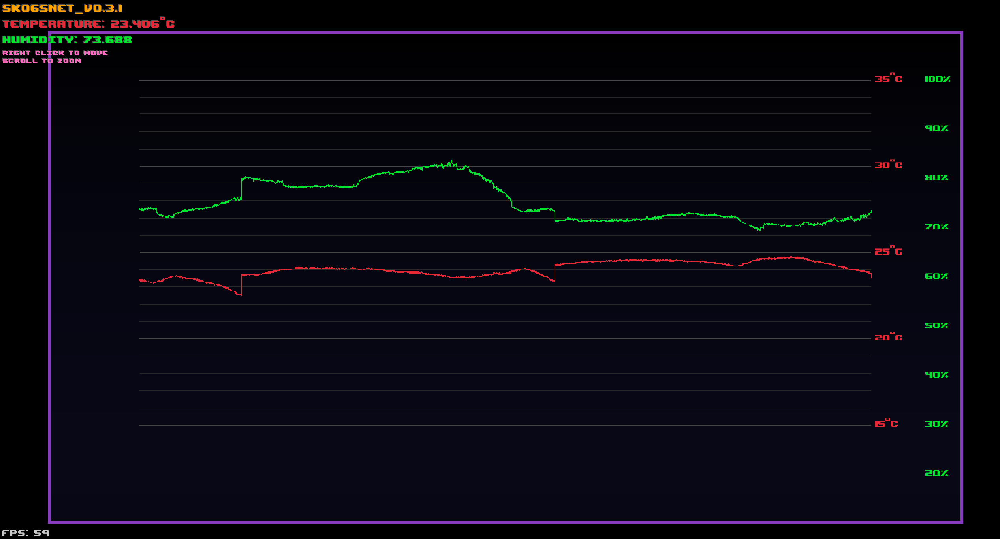

# Skogsnet   [![Badge License]][license]

_Temperature and Humidity monitoring._

<br>

## Concept

Using a **[I2C Grove Sensor]**, you can transmit <br>
temperature / humidity data with a **[Arduino <br>
MKR1010 Wifi][arduino]**
board.

The Arduino sends the data through Serial USB <br>
to the host, where the program `skogsnet.cpp` <br>
reads the serial stream and parses the JSON data.

This data can then be used as inputs to some <br>
logic, a PID regulator implementation perhaps.

The data received by the skogsnet program is written out to **output.dat**

<br>

## Example make Output

```bash
Creating directories
mkdir -p build

Building and running the raylib frontend
./raylib_frontend/build.sh&

Building the program
clang -Wall -g -std=c++11 -fopenmp -I/usr/include -o ./build/skogsnet_v0.0.2 ./code/PID.cpp ./code/skogsnet.cpp -L /usr/lib -fopenmp -lstdc++ -lm
Compiling raylib_frontend

-- Testing if -Werror=pointer-arith can be used -- compiles
-- Testing if -Werror=implicit-function-declaration can be used -- compiles
-- Testing if -fno-strict-aliasing can be used -- compiles
-- Using raylib's GLFW
-- Including X11 support
-- Audio Backend: miniaudio
-- Building raylib static library
-- Generated build type: Debug
-- Compiling with the flags:
--   PLATFORM=PLATFORM_DESKTOP
--   GRAPHICS=GRAPHICS_API_OPENGL_33
-- Configuring done (0.3s)
-- Generating done (0.0s)
-- Build files have been written to: /home/avic/projects/Skogsnet/build
make[1]: Entering directory '/home/avic/projects/Skogsnet/build'
[ 70%] Built target glfw
[ 94%] Built target raylib
[ 97%] Building CXX object CMakeFiles/Frontend.dir/Frontend.cpp.o
./build/skogsnet_v0.0.2
	Settings up time measurement and serial communications...
./build/skogsnet_v0.0.2

      Trying port: /dev/ttyACM0

        Skogsnet is running now, connected to port: /dev/ttyACM0

{
    "humidity": 66.375,
    "temperature_celcius": 26.125
}


        Measurement:
        Timestamp:		1688155892569
        TemperatureCelcius:	26.125000
        Humidity:		66.375000

        Time (s)	System Output		ControllerOutput	CorrectedOutput
        t: 0.000000	measurement: 26.125000	pid.out: -10.000000	correctedOutput: 0.000000
	Successfully wrote to file: 1688155892569	26.125000	66.375000	-10.000000	0.000000

	Simulated 1000 steps out of 1000 total steps
	PID computation total run time: (s): 0.000188
	PID computation total run time (ms): 0.187874
	PID computation total run time (μS): 187.873840
[100%] Linking CXX executable Frontend
[100%] Built target Frontend
make[1]: Leaving directory '/home/avic/projects/Skogsnet/build'
make[1]: Entering directory '/home/avic/projects/Skogsnet/build'
[ 70%] Built target glfw
[ 94%] Built target raylib
[100%] Built target Frontend
make[1]: Leaving directory '/home/avic/projects/Skogsnet/build'
Running raylib_frontend

	No input args OK!
Current working directory: /home/avic/projects/Skogsnet
	Hello from raylib_frontend!
	 Successfully read 2459 data points from file!
{
    "humidity": 66.375,
    "temperature_celcius": 26.09375
}


        Measurement:
        Timestamp:		1688155897626
        TemperatureCelcius:	26.093750
        Humidity:		66.375000

        Time (s)	System Output		ControllerOutput	CorrectedOutput
        t: 0.000000	measurement: 26.093750	pid.out: -10.000000	correctedOutput: -9.326022
	Successfully wrote to file: 1688155897626	26.093750	66.375000	-10.000000	-9.326022

	Simulated 1000 steps out of 1000 total steps
	PID computation total run time: (s): 0.000187
	PID computation total run time (ms): 0.187159
	PID computation total run time (μS): 187.158585
	DataPointCount: 2460
{
    "humidity": 66.25,
    "temperature_celcius": 26.15625
}


        Measurement:
        Timestamp:		1688155902683
        TemperatureCelcius:	26.156250
        Humidity:		66.250000

        Time (s)	System Output		ControllerOutput	CorrectedOutput
        t: 0.000000	measurement: 26.156250	pid.out: -10.000000	correctedOutput: -19.051542
	Successfully wrote to file: 1688155902683	26.156250	66.250000	-10.000000	-19.051542

	Simulated 1000 steps out of 1000 total steps
	PID computation total run time: (s): 0.000089
	PID computation total run time (ms): 0.088930
	PID computation total run time (μS): 88.930130
	DataPointCount: 2461
{
    "humidity": 66.25,
    "temperature_celcius": 26.125
}

```

## Dependencies

_How to install required dependencies._

```shell
sudo pacman -S nlohmann-json
```

## Running

_How to start both programs._

```shell
make
```

## Screenshot



<!----------------------------------------------------------------------------->

[badge license]: https://img.shields.io/badge/License-GPL_3-blue.svg?style=for-the-badge
[i2c grove sensor]: https://www.seeedstudio.com/Grove-Temperature-Humidity-Sensor-High-Accuracy-Mini.html
[arduino]: https://docs.arduino.cc/hardware/mkr-1000-wifi
[license]: #
